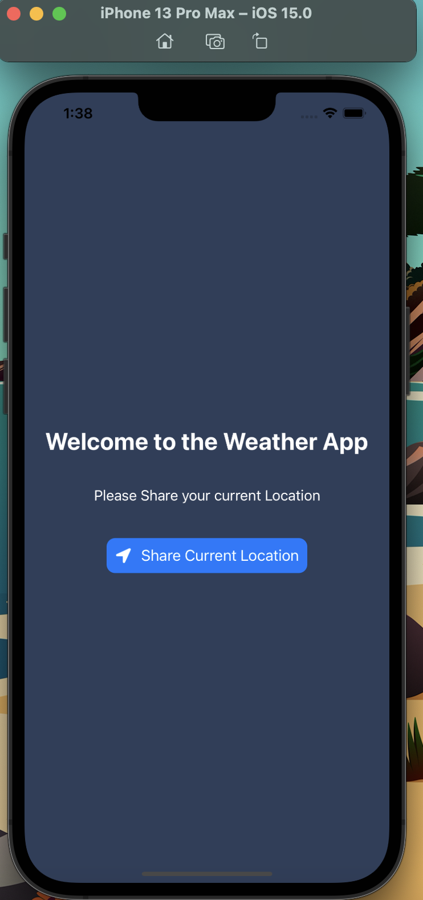
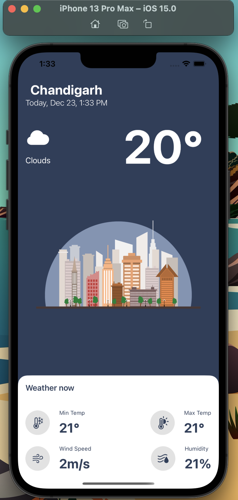
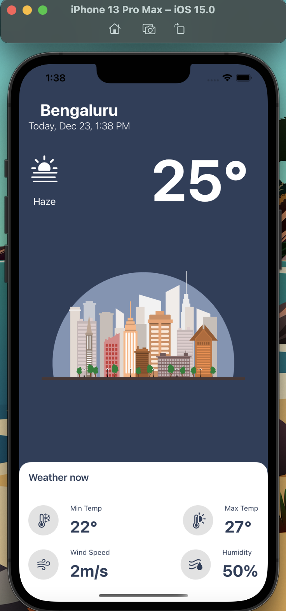

# iOS_Weather_App

In thid Project, I made a two page IOS Weather App using Swift Language, Open Weather API and XCode IDE.

Some ScreenShots of Simulator Running Project are :-

 

In this Project, I fetched latitudinal and longitudinal Location of the user by using inbuilt CoreLocation library of Swift, I used that information with various exception handling to get the current weather information using OpenWeather Current weather API.

This API is able to fetch various weather iformation like humidity, wind, minimum temperature for the day, maximum temperature of the day.
I used that information to display weather on the main weather view page of the app with a nice background in an alluring way. Also showed weather condition using SF symbol. 
